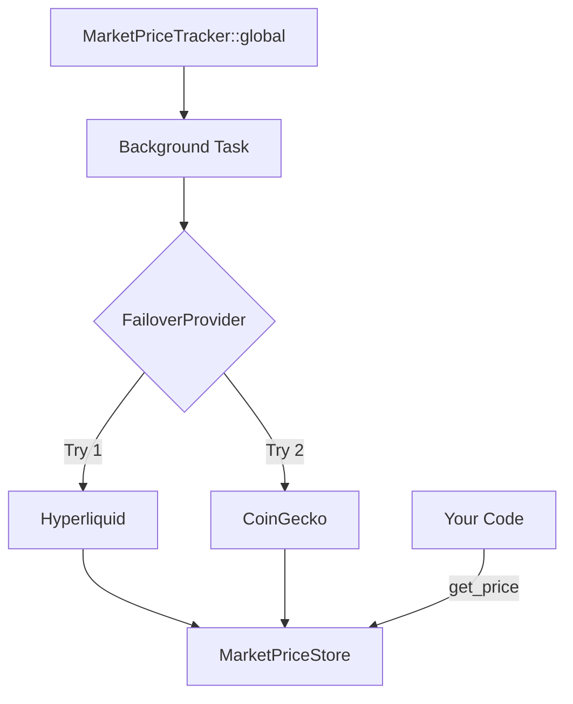

# Market Price SDK

A high-performance Rust SDK for tracking real-time cryptocurrency market prices for major assets (SOL, BTC, ETH, etc.).

## Features

- **Automated Failover**: Prioritizes **Hyperliquid** (mid-prices) with automatic fallback to **CoinGecko**.
- **In-Memory Cache**: Sub-microsecond price retrieval from a thread-safe `RwLock` store.
- **Background Polling**: Low-profile background task handles all API orchestration.
- **Resilient**: Built-in exponential backoff, retry logic, and staleness detection.
- **Singleton Design**: Simple `MarketPriceTracker::global()` interface for easy integration.

## Quick Start

### Basic Usage

```rust
use market_price_sdk::{MarketPriceTracker, Asset};

#[tokio::main]
async fn main() -> Result<(), Box<dyn std::error::Error>> {
    // Get the global tracker (initializes on first call)
    let tracker = MarketPriceTracker::global().await;

    // Get a price (checks cache first, handles staleness)
    match tracker.get_price(Asset::SOL).await {
        Ok(price) => println!("SOL Price: ${:.2} (via {})", price.price_usd, price.source),
        Err(e) => eprintln!("Error: {}", e),
    }

    Ok(())
}
```

## Configuration

The SDK uses zero runtime config files. Behavior is controlled via compile-time constants in `src/constants.rs` and environment variables:

| Variable | Description | Default |
|----------|-------------|---------|
| `MARKET_PRICE_PROVIDER` | Selection: `failover`, `hyperliquid`, or `coingecko` | `failover` |
| `RUST_LOG` | Logging level (e.g., `info`, `debug`) | `info` |

## Benchmarks

The SDK is optimized for high-frequency trading where decision latency is critical.

| Operation | Latency | Source |
|-----------|---------|--------|
| **Cache Retrieval** | ~850ns - 1.5µs | In-process memory |
| **API Refresh** | 350ms - 450ms | External Network |

Run the benchmarks yourself:
```bash
cargo run --example sol_price_benchmark
```

## Architecture

The tracker manages a background loop that populates an internal `MarketPriceStore`.



## License

MIT
